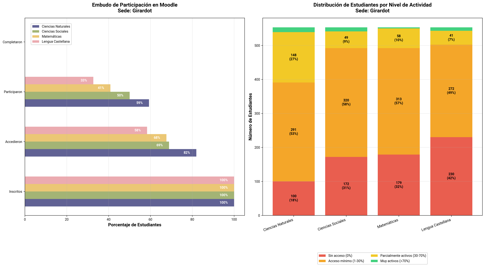
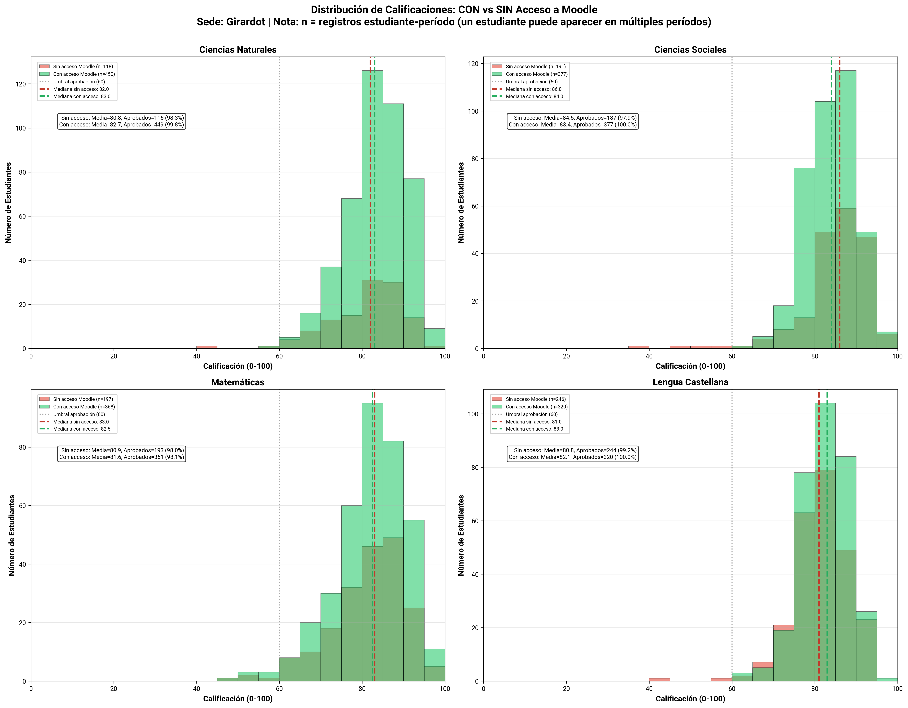

# Análisis de Comportamiento en Moodle

## Resumen

Este análisis explora el comportamiento de **357 estudiantes únicos** en la plataforma Moodle, abarcando **261 cursos** desde **2024-1 hasta 2025-1**

**Asignaturas principales:** Matemáticas, Lenguaje, Ciencias Naturales, Ciencias Sociales

---

## 1. Tasa de Accesos Mensuales por Sede

### Visualización

### Descripción

Este gráfico muestra la tasa de accesos a Moodle normalizada por cada 10 estudiantes inscritos, permitiendo una comparación entre sedes con diferente cantidad de estudiantes.

### Interpretación

- **Formato de etiquetas:** Cada barra muestra:
  - **Número superior:** Tasa normalizada (accesos/10 estudiantes)
  - **Número entre paréntesis:** Total de accesos absolutos

- **Tasa alta (>100):** Indica que, en promedio, cada estudiante accede más de 10 veces al mes a la plataforma.
- **Tasa baja (<50):** Sugiere uso limitado de Moodle.
- **Variabilidad mensual:** Picos pueden correlacionarse con evaluaciones o inicio/fin de períodos académicos.

### Conclusiones

- La caída abrupta en junnio y noviembre podría estar asociada al fin del periodo académico y vacaciones.

- Fusagasugá mantiene un uso sostenido, mientras que Girardot presenta actividad a más baja escala.

- En Fusagasugá se observan picos de accesos en el primer mes del año, pero no en Girardot lo que puede indicar estrategias distintas y menor sincronía entre el calendario escolar y el uso de Moodle.

## 2. Porcentaje de Estudiantes Activos por Mes

### Visualización

### Descripción

Muestra el porcentaje de estudiantes inscritos que accedieron al menos una vez a Moodle en cada mes, por sede.

### Interpretación

- **Formato de etiquetas:** Cada barra muestra:
  - **Porcentaje (%):** Proporción de estudiantes que accedieron
  - **Número entre paréntesis:** Cantidad absoluta de estudiantes únicos
- **Umbral de participación:** Se considera que un estudiante "accedió" si tiene al menos 1 registro de actividad en el mes.

- **>80%:** Excelente nivel de adopción, la mayoría de estudiantes usa la plataforma.
- **60-80%:** Buena adopción.
- **<60%:** Señal de alerta, una porción significativa de estudiantes no usa Moodle.

### Conclusiones

- La gran mayoría de los estudiantes en Fusagasugá entra al menos una vez al mes, lo que sugiere que Moodle está incorporado en la rutina académica.
- En Girardot el acceso parece más episódico, reflejando un uso vinculado a momentos específicos más que a una práctica estable.

## 3. Patrones de Acceso por Hora

### Visualización

### Descripción

Análisis de la distribución de accesos y estudiantes únicos por hora del día (hora de Bogotá, UTC-5).

### Interpretación

- **Gráfico izquierdo:** Total de accesos por hora del día.
- **Gráfico derecho:** Número de estudiantes únicos activos por hora.

### Conclusiones

- En ambas sedes, la mayor actividad ocurre entre las 7:00 a.m. y las 3:00 p.m., lo que indica que el uso de Moodle está integrado en la jornada escolar.

- Después de esa franja, la interacción cae drásticamente, lo que sugiere bajo uso autónomo fuera del horario de clases.

- Fusagasugá muestra un volumen de accesos significativamente superior durante todo el día, además de una curva más sostenida y diversificada, con picos regulares entre las 8:00 y las 14:00 h.

- En Girardot, la distribución horaria replica la tendencia general, pero con una menor magnitud y continuidad de accesos.

## 4. Mapas de Calor: Participación por Asignatura y Grado

### Visualizaciones

#### Sede: Fusagasugá

#### Sede: Girardot

### Descripción

Los mapas de calor muestran dos métricas de engagement en Moodle:

1. **% de Módulos Vistos (Mediana):** Porcentaje de módulos del curso que los estudiantes visualizaron al menos una vez.
2. **% de Módulos con Participación (Mediana):** Porcentaje de módulos donde los estudiantes realizaron actividades interactivas (no solo visualización).

### Interpretación

- **Métrica:** Se usa la mediana para evitar el sesgo de valores extremos.
- **Ejes:**
  - **Horizontal:** Asignaturas básicas (Matemáticas, Lenguaje, Ciencias Naturales, Ciencias Sociales)
  - **Vertical:** Grados (1° a 11°)
- **Escala de colores:**
  - 🟢 **Verde (>70%):** Alta participación
  - 🟡 **Amarillo (40-70%):** Participación moderada
  - 🔴 **Rojo (<40%):** Baja participación (señal de alerta)

### Conclusiones

- **Fusagasugá:** 
    - No se identifican grados con un problema particular, ya que la participación moderada es generalizada.
    - La baja actividad esta probablemente determinada por condiciones institucionales comunes más que por el nivel del grado.

- **Girardot:**
    - La participación activa es extremadamente baja en todos los grados, con medianas entre 0 % y 2,4 %.
    - En términos comparativos, Girardot muestra una menor participación que Fusagasugá, indicando posibles diferencias en el uso de Moodle.
    - No hay una asignatura con buena participación, sino una tendencia global de interacción mínima en Moodle.

- El contraste entre módulos “vistos” y módulos “participados” evidencia que los estudiantes acceden pero no interactúan, lo que apunta a posibles problemas en el diseño de actividades o en la motivación para usar Moodle más allá de la consulta de materiales.

## 5. Diagnóstico de Participación

### Visualizaciones

#### Sede: Fusagasugá

#### Sede: Girardot

### Interpretación

#### **Embudo de Participación (Izquierda)**
Muestra las 4 etapas del proceso de engagement en Moodle:
1. **Inscritos (100%):** Todos los estudiantes matriculados en el curso
2. **Accedieron:** Estudiantes que entraron a Moodle al menos 1 vez
3. **Participaron:** Estudiantes que realizaron actividades interactivas
4. **Completaron:** Estudiantes que visualizaron todos los módulos del curso

#### **Distribución por Nivel de Actividad (Derecha)**
Segmenta a los estudiantes en 4 categorías:
- 🔴 **Sin acceso (0%):** Nunca entraron a un módulo de Moodle
- 🟠 **Acceso mínimo (1-30%):** Visualizaron menos del 30% de los módulos
- 🟡 **Parcialmente activos (30-70%):** Engagement moderado
- 🟢 **Muy activos (>70%):** Alta participación en el curso

Nota: El número de estudiantes representa inscripciones estudiante-período. Un estudiante inscrito en 4 períodos cuenta como 4 estudiantes en la gráfica.

### Conclusiones

- **Fusagasugá:** 
    - Aunque los tres primeros niveles del embudo (inscritos, accedieron, participaron) muestran porcentajes altos y cercanos entre sí (≈85–95 %), el nivel “Completaron” no tiene datos.
    - Predominan los estudiantes parcialmente activos (30–70 %), seguidos de un grupo numeroso con acceso mínimo (1–30 %).
    - Solo entre 6 % y 9 % son muy activos, un grupo pequeño pero consistente.

- **Girardot:**
    - Aquí también el nivel de “Completaron” está vacío, pero además se observa una caída más pronunciada entre “Accedieron” y “Participaron”.
    - Esto revela que, aunque un porcentaje relevante accede a la plataforma (≈60–70 %), solo la mitad o menos participa.
    - La mayoría está en las categorías de acceso mínimo o parcial, pero con una proporción elevada de estudiantes sin acceso (18–42 %), sobre todo en Lengua Castellana

- En ambas sedes, la ausencia de datos de “completaron” indica una limitación del seguimiento en Moodle.
- Girardot requiere acciones de acompañamiento o refuerzo para transformar el acceso inicial en participación efectiva.

## 6. Calificaciones: Con vs Sin Acceso a Moodle

### Visualizaciones

#### Sede: Fusagasugá

#### Sede: Girardot

### Descripción

Comparación de la distribución de calificaciones finales (escala 0-100) entre dos grupos de estudiantes:
- 🔴 **Sin acceso a Moodle:** Estudiantes que NO visualizaron ningún módulo
- 🟢 **Con acceso a Moodle:** Estudiantes que visualizaron al menos 1 módulo

### Interpretación

- **Escala:** Calificaciones de 0 a 100 puntos.
- **Umbral de aprobación:** Línea punteada gris a los 60 puntos.
- **Líneas de mediana:** 
  - 🔴 Roja (sin acceso)
  - 🟢 Verde (con acceso)
- **Estadísticas incluidas:**
  - Media de calificaciones
  - Número y porcentaje de estudiantes aprobados
- **Nota importante:** `n = registros estudiante-período` (un mismo estudiante puede aparecer en múltiples períodos).

#### **Si la mediana VERDE está a la derecha de la ROJA:**
- **Impacto positivo de Moodle:** Los estudiantes que usan la plataforma tienen mejores calificaciones.
- Evidencia de correlación entre uso de Moodle y desempeño académico.

#### **Si ambas medianas están cerca:**
- **Moodle no marca diferencia:** El uso de la plataforma no se refleja en mejores notas.

#### **Si hay muchos estudiantes SIN acceso con notas altas:**
- Los buenos estudiantes pueden aprobar sin Moodle.
- Moodle no es percibido como necesario para el éxito académico.

#### **Si hay muchos estudiantes CON acceso con notas bajas:**
- Acceder a Moodle no garantiza el éxito.

### Conclusiones

- **Fusagasugá:** 
    - En todas las asignaturas, la línea verde (con acceso a Moodle) está ligeramente a la derecha de la línea roja (sin acceso), lo que indica un impacto positivo moderado del uso de Moodle en las calificaciones.
    - Los estudiantes que accedieron a Moodle tienden a obtener calificaciones ligeramente más altas.
    - La diferencia no es drástica, pero sí consistente entre materias.

- **Girardot:**
    - Aquí, las líneas verde y roja están casi superpuestas, lo que muestra que el uso de Moodle no mejora sustancialmente las calificaciones
    - Moodle parece tener baja incidencia en el desempeño académico.
    - Las calificaciones promedio y medianas son casi idénticas con y sin acceso.

## 7. Patrones de Navegación en Secuencias

### Visualizaciones

#### Sede: Fusagasugá

#### Sede: Girardot

### Descripción

Análisis avanzado de cómo los estudiantes **navegan a través de las secuencias de actividades** en los cursos de Moodle, comparando su ruta real con la secuencia pedagógica ideal diseñada por los docentes.

#### **Tres Métricas Clave:**

1. **Adherencia a la Secuencia Ideal (Sequence Match Ratio)**
   - Mide qué tan bien los estudiantes siguen el orden recomendado de actividades.
   - 100% = siguió perfectamente la secuencia diseñada por el docente.

2. **Distancia de la Secuencia Ideal (Levenshtein Normalizado)**
   - Cuantifica cuántas "ediciones" serían necesarias para convertir la secuencia del estudiante en la ideal.
   - 0% = secuencia idéntica a la ideal.
   - Mayor porcentaje = mayor desviación de la ruta pedagógica planeada.

3. **Actividades Faltantes (Missing Activities)**
   - Número promedio de actividades que los estudiantes NO visitaron dentro de la secuencia.
   - Escala automática según el número de actividades en cada curso.

### Interpretación

- **Métrica:** Se usa la mediana para cada combinación asignatura-grado-sede.
- **Escala de colores:**
  - **Adherencia y Orden:** 🟢 Verde (alta adherencia) → 🔴 Rojo (baja adherencia)
  - **Distancia:** 🔴 Rojo (alta distancia) → 🟢 Verde (baja distancia) [invertido]
  - **Actividades faltantes:** 🟡 Amarillo (pocas) → 🔴 Rojo (muchas)

- **Alta adherencia (>80%):**
  - ✅ Los estudiantes siguen el camino pedagógico diseñado.
  - ✅ La secuencia de actividades es lógica e intuitiva.
  - ✅ Posiblemente hay guías claras o secuenciación obligatoria.

- **Baja adherencia (<50%):**
  - ⚠️ Los estudiantes navegan "al azar" o saltándose actividades.
  - ⚠️ Puede indicar:
    - Secuencia mal diseñada (no es clara)
    - Falta de prerrequisitos entre actividades
    - Estudiantes avanzados que buscan contenido específico

- **Muchas actividades faltantes:**
  - 🔴 Estudiantes no completan el recorrido del curso.
  - 🔴 Posibles causas:
    - Contenido muy extenso
    - Actividades poco atractivas
    - Desmotivación

### Conclusiones

- **Fusagasugá:** 
    - La navegación parcialmente estructurada; los estudiantes avanzan con cierta lógica, pero no siempre siguen el orden completo ni completan todas las actividades.

- **Girardot:** 
    - Los estudiantes parecen interactuar con Moodle de manera más esporádica, con muchos saltos y abandono de actividades.

- Las áreas de Ciencias Sociales y Lengua Castellana presentan los mayores desafíos en ambas sedes, tanto en adherencia como en finalización.
